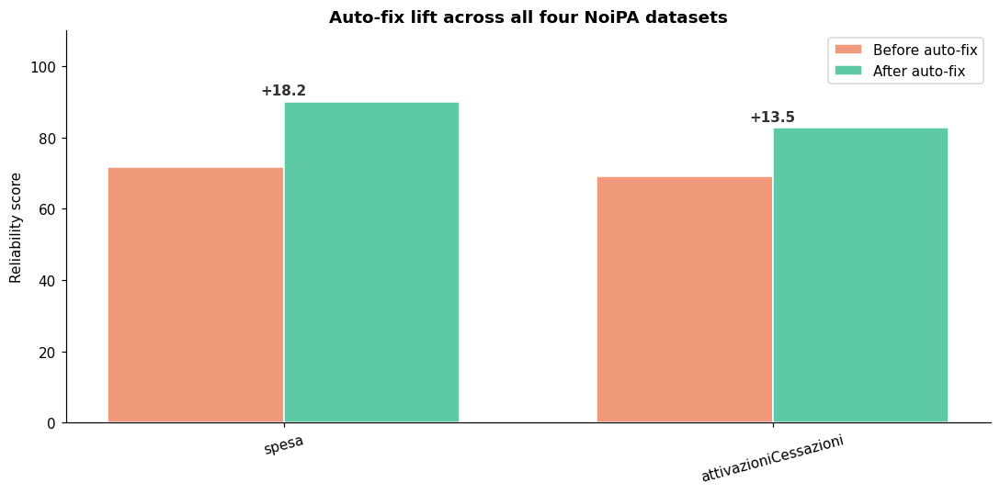
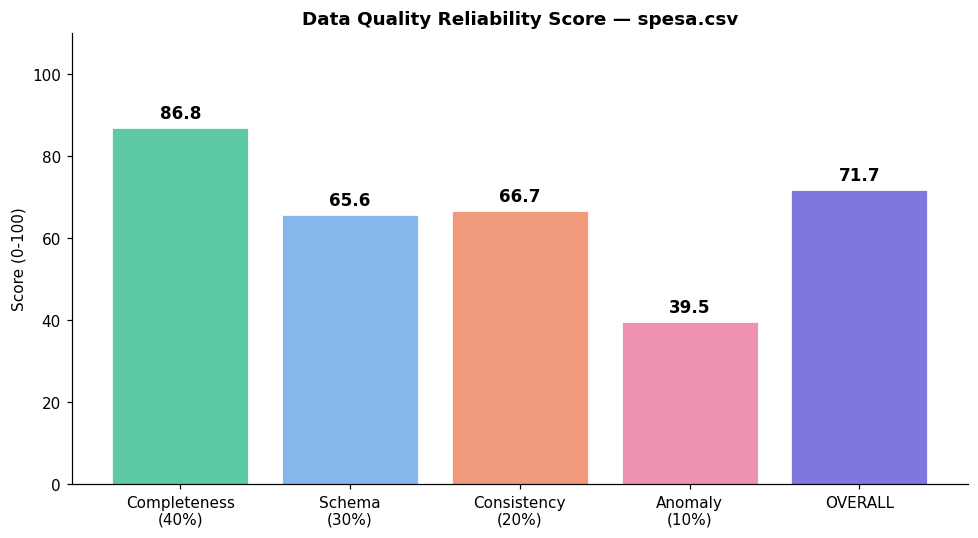

# Multi-Agent Data Quality System for NoiPA

**Course:** Machine Learning 2025/26 — Reply x LUISS  
**Team:** Eleonora Cappetti (812591) · Daniela Chiezzi (808021) · Chiara De Sio (819591)  
**Repository:** [chiaraadesio-hue/Data-Quality-Agents-819591](https://github.com/chiaraadesio-hue/Data-Quality-Agents-819591)

---

## Section 1 — Introduction

NoiPA is the digital payroll platform of the Italian Ministry of Economy and Finance. It manages salaries, timesheets and tax obligations for more than two million public-administration employees, and it ingests data from a heterogeneous landscape of CSVs, JSON dumps and operational databases. Today most of the validation that happens before that data flows into the payroll engine is either manual or non-existent, which means that errors propagate downstream until they cause concrete problems — wrong tax codes, missing benefits, duplicate payments.

This project asks: *can a team of specialised agents do that validation automatically, produce an audit-ready report, and ship a cleaned version of the dataset that a human reviewer can trust by default?*

Our answer is a **six-agent pipeline** orchestrated with [LangGraph](https://langchain-ai.github.io/langgraph/) and grounded by [Google Gemini 2.0 Flash](https://ai.google.dev/) for the two parts of the job that genuinely benefit from a language model: inferring the *semantic role* of each column (is it an identifier, a period, an amount?) and writing a remediation plan in plain English at the end. Everything else — the actual quality decisions, the score, the auto-fixes — runs on deterministic, reproducible code so that the same input always yields the same audit.

The system is shipped as three artefacts: a Python module (`dq_agents.py`) that contains all six agents and is independently importable and testable; a Jupyter notebook (`main.ipynb`) that orchestrates them with LangGraph and walks through each step with explanatory prose; and a Streamlit dashboard (`app.py`) that reproduces the full analysis interactively in the browser without requiring an API key.

We test the pipeline on four datasets: two small synthetic files we built during development to exercise specific edge cases (51 and 40 rows), and the two realistic files Reply provided as the benchmark — `spesa.csv` (~7 500 rows) and `attivazioniCessazioni.csv` (~20 100 rows).

---

## Section 2 — Methods

### 2.1 Architecture


The pipeline is a linear LangGraph: `schema → completeness → consistency → anomaly → autofix → remediation`. Each node reads the shared `DQState` dictionary, runs its own checks, writes its findings back into the state, and forwards control to the next node. We chose a linear topology because every step depends on all previous ones — the auto-fix needs every issue list, the remediation needs the auto-fix log — and a more complex topology would buy nothing in latency since the LLM call dominates the wall-clock cost of each LLM-touched node.

### 2.2 The six agents

**1. Schema Validation** runs three checks: it scores each column name against snake-case conventions with an explicit *minor / major* split (wrong casing is cosmetic, a leading digit or a special character is structural); it infers the expected type of each column from a sample and flags type mismatches; and it scans every column pair for near-duplicates. The duplicate detection compares values both raw and after a normalising pass (case-folding plus placeholder stripping), so that a pair like `provincia_sede` (containing `'Aq'`, `'?'`, `'Pt'`) and `Provincia Sede` (containing the cleaned `'AQ'`, `'PA'`, `'PT'`) is correctly identified as the same logical column with two different cleanliness levels. The agent then asks Gemini to label each column with a *semantic role* (identifier, period, amount, …); the LLM output is parsed as JSON and merged into the per-column results without overwriting any of the deterministic findings.

**2. Completeness Analysis** counts both real `NaN`s and a curated set of placeholder strings that look like missing data even when pandas treats them as valid: `'-'`, `'N/A'`, `'?'`, `'??'`, `'TBD'`, `'da definire'`, `'00'`, `'//'`, and a dozen more. Per-column completeness is a percentage; columns under 30% complete are flagged as **sparse** and become removal candidates for the auto-fix.

**3. Consistency Validation** runs three sub-checks. *Format consistency* classifies every value in a column as `YYYYMM`, `YYYY-MM`, `decimal`, `integer`, `text`, etc., and flags columns whose values mix more than one format. *Cross-column logic* validates `Tipo_imposta × Imposta` relationships using rules **mined from the data itself** when at least 30 rows per `Tipo` are available, and falls back to a hard-coded reference taxonomy on tiny datasets. This design means the agent adapts to new NoiPA datasets without code changes; we made this choice after observing that the real `spesa.csv` contains tax categories (`Da definire`, `Mista`, `Assistenziali`, `Netto`) that no static taxonomy would have covered. *Duplicate detection* finds exact duplicates with a hash-based group-by and near-duplicates by sampling 500 rows and looking for pairs that differ in exactly one column.

**4. Anomaly Detection** flags numerical outliers only when *both* a Z-score test (`|z| > 3`) and an IQR test (`v ∉ [Q1−1.5·IQR, Q3+1.5·IQR]`) agree. Requiring two-test agreement cuts the false-positive rate dramatically on heavy-tailed columns like `spesa`, where a single test would flag every legitimately large payment. For categorical columns we flag values whose share is below 0.5%; the check is *skipped* on datasets with fewer than 200 rows, because on a 50-row file even legitimate values appear once or twice and would all look "rare".

**5. Auto-Fix (Cleaner)** applies only the seven *safe* transformations in the table below, every one of them recorded in a structured `fix_log`. Outliers and near-duplicates are deliberately *not* auto-fixed: the right action is domain-dependent and must stay with the human reviewer.

| # | Action | Why it is safe |
|---|---|---|
| 1 | Drop near-identical duplicate columns (similarity ≥ 0.97) | Two columns carrying the same data is never useful. |
| 2 | Drop sparse columns (< 30 % complete) | A column 70 %+ empty is noise, not signal. |
| 3 | Rename columns to `snake_case` | Cosmetic, fully reversible from the rename map in the log. |
| 4 | Replace placeholder strings (`'?'`, `'-'`, `'N/A'`, …) with `NaN` | Makes downstream `isna()` actually work. |
| 5 | Canonicalize categorical casing (`'AQ'` / `'Aq'` / `'aq'` → most frequent) | Removes spurious cardinality. |
| 6 | Standardise period formats (`'2024-01'`, `'2024/01'` → `'202401'`) | Forces every period column to one canonical format. |
| 7 | Drop exact-duplicate rows | Identical rows are safe to remove. |

When a duplicate-column pair is found, the cleaner decides *which* of the two columns to keep using a **combined name + value quality score**: it balances name quality (snake-case, no special characters) against value quality (low placeholder share, consistent casing). This matters because picking on name alone would discard the cleanly-formatted `Provincia Sede` in favour of the dirty `provincia_sede`.

**6. Remediation** computes the weighted reliability score and asks Gemini to write a remediation plan grounded in the exact agent summaries and auto-fix log. The LLM is not allowed to invent issues. The score formula:

$$\text{score} = 0.40\cdot S_\text{comp} + 0.30\cdot S_\text{schema} + 0.20\cdot S_\text{cons} + 0.10\cdot S_\text{anom}$$

The schema sub-score distinguishes *minor* naming issues (−5 pts each) from *major* ones such as leading digits or embedded spaces (−20 pts), plus a deduction for each duplicate column pair. This tiered approach was introduced after the mid-check, where the original all-or-nothing schema score collapsed to 0.0 on both Reply datasets.

### 2.3 The Gemini layer

Gemini 2.0 Flash is used in exactly two places: schema-semantic inference (Agent 1) and remediation-plan generation (Agent 6). Three design choices keep the LLM outputs honest: temperature is set to 0 for reproducibility; the schema prompt asks for a fixed JSON shape parsed mechanically; all commentary prompts are grounded in deterministic findings and explicitly forbid the model from adding any issues of its own. If the API key is missing or a call fails, every commentary falls back to a sentinel string and the rest of the pipeline still runs.

### 2.4 Reproducing the environment

```bash
python3 -m venv venv && source venv/bin/activate
pip install -r requirements.txt
# add GOOGLE_API_KEY=... to a .env file
jupyter lab main.ipynb          # notebook walkthrough
streamlit run app.py            # interactive dashboard
```

---

## Section 3 — Experimental Design

### Experiment 1 — Does the auto-fix measurably improve a dataset?

**Purpose.** Verify that the cleaner produces a dataset whose recomputed reliability score is higher than the original. If the score does not move, the cleaner is cosmetic.

**Baseline.** The reliability score computed on the raw dataset before the cleaner runs.

**Metric.** Lift in the weighted reliability score (0–100), reported per dataset and per sub-score. We also count the number and kinds of fix-log entries to confirm that the fixes actually happened.

**Why this metric.** The reliability score is the headline of the report; if the auto-fix improves it, every downstream consumer sees the improvement immediately. The sub-score breakdown shows *which* dimension of quality the fixes actually touched.

### Experiment 2 — Does the pipeline generalise across very different datasets?

**Purpose.** A pipeline that works only on the toy dataset is not interesting. We run the same code on four datasets that differ by two orders of magnitude in row count and by very different patterns of dirtiness, and we verify that:

1. the cleaner applies *more* fixes on the dirtier datasets;
2. the cleaner applies *no spurious* fixes on the cleaner ones;
3. the fix list matches the issues we identified by manual inspection.

**Baseline.** Manual inspection carried out during development, described per dataset in Section 4.

**Metric.** Number of fix-log entries per dataset, kinds of fixes applied, and qualitative agreement with the manual inspection findings.

---

## Section 4 — Results

### 4.1 Auto-fix lift across all four datasets



| Dataset | Rows | Cols | Score before | Score after | Lift | Fixes |
|---|---:|---:|---:|---:|---:|---:|
| `dataset_noipa_1.csv` | 51 | 6 | 94.5 | 98.6 | **+4.1** | 3 |
| `dataset_noipa_2.csv` | 40 | 7 | 87.9 | 97.1 | **+9.1** | 4 |
| `spesa.csv` | 7 543 | 18 | 70.7 | 88.9 | **+18.1** | 16 |
| `attivazioniCessazioni.csv` | 20 102 | 19 | 69.2 | 82.7 | **+13.5** | 17 |

The lift scales with the dirtiness of the dataset. On the two synthetic files the lift is modest (the data was designed to be mostly clean). On the two Reply files, where the score starts in the low-70s, the cleaner pushes it into the mid-to-high 80s — the range where the data becomes practically usable for downstream payroll calculations.

### 4.2 Score breakdown for `spesa.csv`



The schema and consistency sub-scores are the most affected by the cleaner: the schema score starts around 65 (four duplicate-column pairs plus seven non-snake-case names) and recovers above 90 once those are resolved. The anomaly sub-score is deliberately stable across before/after, because the cleaner does not touch outliers.

### 4.3 What the cleaner does on `spesa.csv` — detailed fix log

```
1.  drop_duplicate_column    ente%code           kept: ente          (sim 99.7%)
2.  drop_duplicate_column    2cod_imposta        kept: cod_imposta   (sim 99.7%)
3.  drop_duplicate_column    cod imposta ext     kept: cod_imposta   (sim 99.7%)
4.  drop_duplicate_column    SPESA TOTALE        kept: spesa         (sim 99.5%)
5.  drop_sparse_column       note                completeness 2.0%
6.  drop_sparse_column       fonte_dato          completeness 1.0%
7.  rename_columns           schema              12 columns → snake_case
8.  replace_placeholders     ente                118 cells → NaN
9.  replace_placeholders     descrizione         169 cells → NaN
10. replace_placeholders     tipo_imposta         47 cells → NaN
11. replace_placeholders     cod_imposta          72 cells → NaN
12. replace_placeholders     imposta             137 cells → NaN
13. replace_placeholders     spesa                55 cells → NaN
14. canonicalize_categorical tipo_imposta        'Erariali ', 'erariali', 'ERARIALI' → 'Erariali'
15. standardize_format       rata                60 cells reformatted to YYYYMM
16. drop_duplicate_rows      rows                40 exact duplicates removed
```

After the cleaner: 18 → 12 columns, 7 543 → 7 503 rows, score 70.7 → 88.9.

### 4.4 Robustness check — synthetic datasets

On `dataset_noipa_1.csv` the cleaner applies exactly 3 fixes (rename, standardise period, drop 2 exact-duplicate rows) and the score moves from 94.5 to 98.6. No spurious actions are taken. This confirms point 2 of Experiment 2.

### 4.5 What the cleaner deliberately does not fix

Two patterns the auto-fix refuses to touch by design: **outliers** (around 1 000 rows in `spesa.csv` pass the Z+IQR double test; most are large but legitimate payments, and distinguishing them from typos requires domain knowledge) and **near-duplicates** (rows that differ in exactly one column; some are corrections, some are bugs, and the right action is not determinable without a business rule). Both are reported in the audit log, with their row indices, for human review.

---

## Section 5 — Conclusions

A multi-agent design where each agent has a narrow, well-defined responsibility and shares state through a typed graph produces a data-quality system that is auditable end-to-end. Every issue is traced back to the agent that found it; every change to the dataset is traced back to a `fix_log` entry. Concretely, on the two real Reply datasets the auto-fix moves the reliability score by between 13 and 18 points, which is the operational difference between *unusable* and *usable as-is*.

The LLM is used only at the edges — semantic schema inference and natural-language remediation — so the actual quality decisions stay deterministic, reproducible and explainable to a non-technical stakeholder. When we stress-tested the system by removing the API key, the pipeline continued to run and produce a correct numerical report, with the commentary sections replaced by a sentinel string. This separation between deterministic logic and LLM enhancement is the architectural choice we are most confident about.

**Three directions for future work.** First, replacing the IQR/Z-score outlier detector with a per-column model trained on historical NoiPA data would give a sharper false-positive rate on heavy-tailed columns like `spesa`. Second, promoting the auto-fix from *safe-by-rule* to *propose-and-confirm* for ambiguous cases (near-duplicates, suspicious outliers) would turn the system into a true human-in-the-loop tool while keeping the audit trail intact. Third, running the same anomaly-detection problem on a classical non-agentic baseline would let us put a number on the cost and benefit of the multi-agent approach, which today we can only argue about qualitatively.

---

### Repository layout

```
.
├── main.ipynb                    orchestration notebook (LangGraph + Gemini)
├── dq_agents.py                  six agents, ~1100 lines, no LangGraph dependency
├── app.py                        Streamlit dashboard (works offline, no API key needed)
├── requirements.txt
├── README.md
├── data/
│   ├── dataset_noipa_1.csv       synthetic, 51 rows
│   ├── dataset_noipa_2.csv       synthetic, 40 rows
│   ├── spesa.csv                 Reply benchmark, 7 543 rows
│   ├── attivazioniCessazioni.csv Reply benchmark, 20 102 rows
│   ├── cleaned_*.csv             auto-fixed outputs (generated)
│   ├── fix_log_*.json            audit trail (generated)
│   ├── data_quality_report_*.json full machine-readable report (generated)
│   └── benchmark.csv             cross-dataset comparison (generated)
└── images/
    ├── architecture.png
    ├── benchmark.png
    ├── score_*.png
    └── completeness_*.png
```

### Academic-integrity statement

The deterministic logic in `dq_agents.py` and the orchestration in `main.ipynb` were written by the authors. We used Generative AI tools to help with code review and design feedback; the code was tested on all four datasets and verified by manual inspection. The cross-column rule-mining design and the combined name-plus-value column-quality score for duplicate selection are original to this project.
